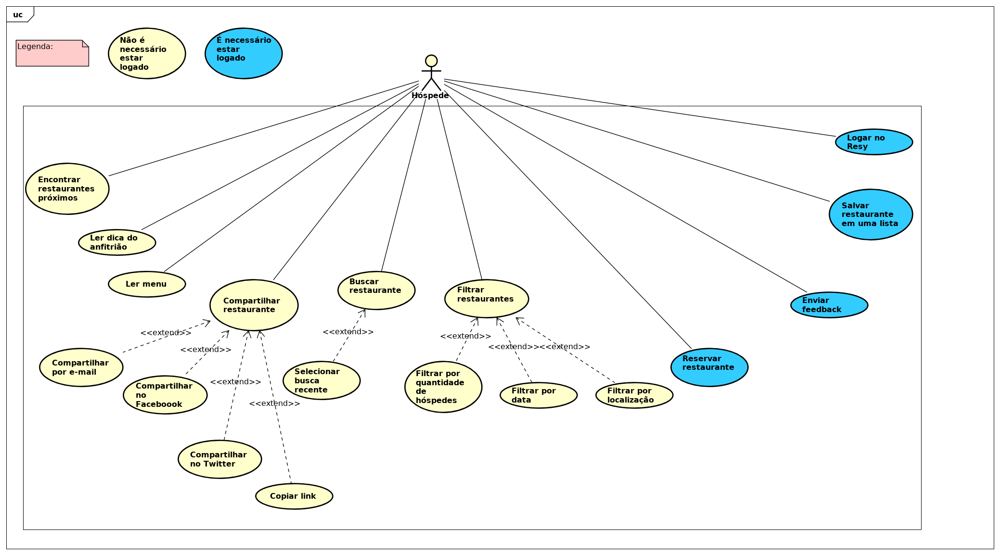
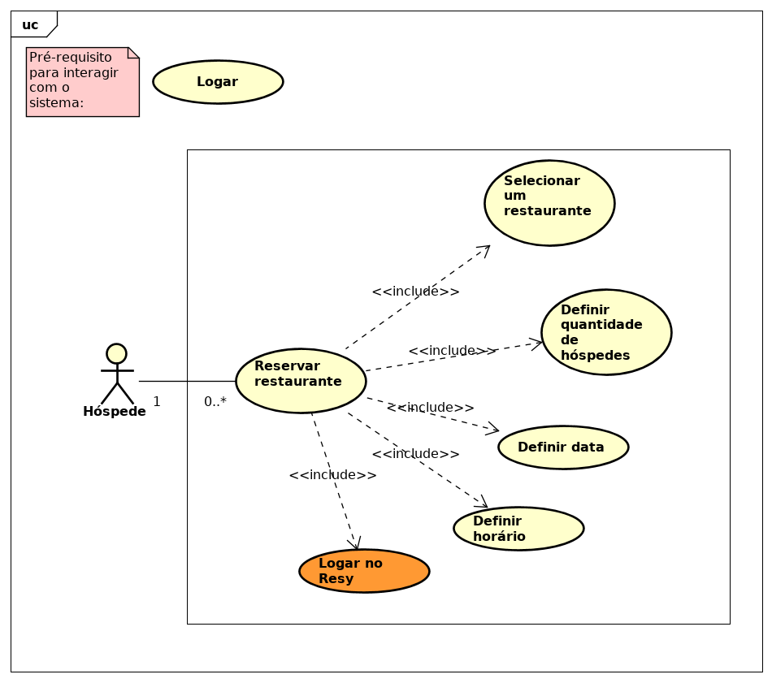
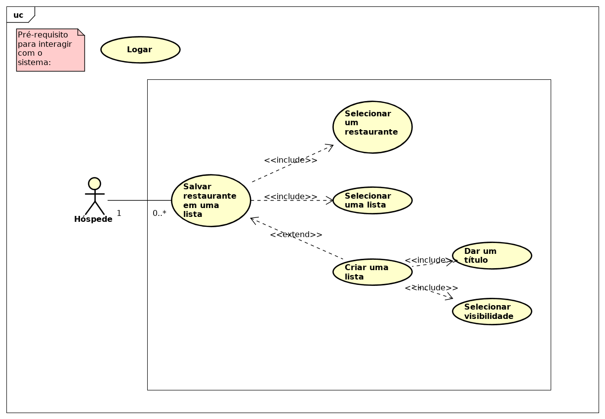
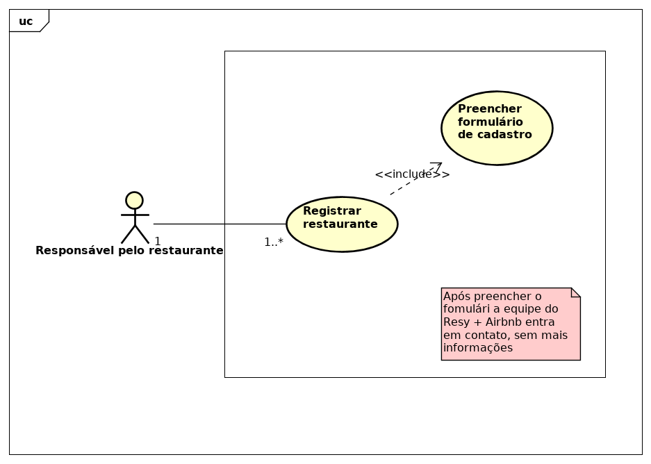

# Casos de uso - Restaurantes

### Diagramas

**Visão geral sobre Restaurante**  

**Buscar Restaurante**  

**Reservar Restaurante**  

**Salvar Restaurante**  

**Registrar Restaurante**  

### Especificações de Casos de uso

#### [UC01 - Buscar Restaurante](uc01-restaurante.md)
 
#### [UC02 - Reservar Restaurante](uc02-restaurante.md) 

#### [UC03 - Selecionar Horário](uc03-restaurante.md)

#### [UC04 - Revisar Reserva](uc04-restaurante.md)

