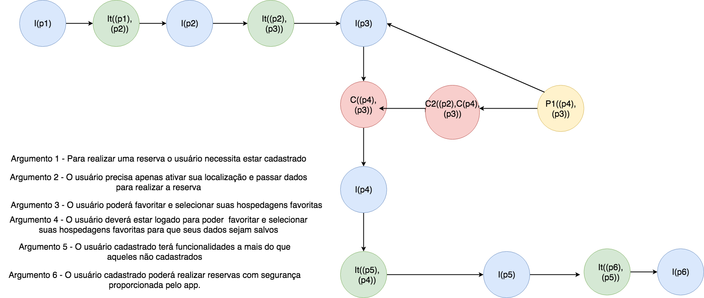

# Pré-rastreabilidade

## Rastreabilidade de requisitos

  A rastreabilidade de requisitos é uma técnica utilizada para prover um relacionamento entre os requisitos levantados, a arquitetura do sistema até sua implementação final, possibilitando assim uma compreensão adequada do contexto no qual o software foi construído. A rastreabilidade é identificada como um fator de qualidade, sendo essa uma das características não funcionais do sistema. A rastrebilidade deve possibilitar acompanhar e relatar a vida de um requisito.

  Esse módulo tem como foco a etapa de **Pré-Rastreabilidade**, que é definida como o estudo do universo de onde são levantados os requisitos.

## Rich Picture

  Rich Picture é uma ferramenta para expressar ideias com o objetivo de resolver um problema, geralmente construídos durante uma entrevista com o cliente impactado pela solução. Ao desenvolver um Rich Picture o engenheiro de requisitos conhece melhor os problemas do cliente, e de forma iterativa refina o processo no qual sua aplicação trabalhará.

#### Visão Geral 1.0

  

#### Hóspede 3.0

#### Anfitrião 3.0

#### Restaurante 1.0

#### Pesquisa de Experiência 1.0

#### Questões Regionais 1.0

#### Relações Entre Usuários 1.0

#### Monetário 2.0

#### Boas Experiências 1.0

#### Central de Resoluções 1.0

#### Segurança 1.0

## Argumentação

O modelo de argumentação do Framework ACE é uma ferramenta que oferece maneiras de modelar e racionar sobre os requisitos discutidos durante uma reunião com os stakeholders, com o objetivo de verificar a validação dos artefatos da solução. O ACE disponibiliza uma vocabulário para representar as informações e decisões levantadas durante a discussão.

#### Escolha de ferramenta de desenho

  <ul>
    <li>
      <b>p0</b> - É necessário usar uma ferramenta de desenho unificada para haver padrão de linguagem nos diagramas de rich picture.
    </li>
    <li>
      <b>p1</b> -  Usar draw io para a execução do rich picture, devido as ferramentas de estilo.
    </li>
    <li>
      <b>p2</b> -  Usar canvas para a execução do rich picture, devido as ferramentas de estilo.
    </li>
    <li>
      <b>p3</b> - draw io pode ser usado apartir do browser e  tem compatibilidade com o google drive.
    </li>
  </ul>

#### Escolha de Termo

#### Anfitrião que já trabalha na área

  <ul>
    <li>
      <b>p0</b> - Usuário possui bom fluxo de clientes e não busca por novos clientes
    </li>
    <li>
      <b>p1</b> - Usuário percebe que apesar de ter bom fluxo, poderia aumenta-lo ainda mais e/ou utilizar de estratégias para tempos de baixo fluxo.
    </li>
    <li>
      <b>p2</b> - Usuário não deseja ampliar o perfil de seus clientes, devido necessidade de de altos investimentos.
    </li>
    <li>
      <b>p3</b> - Através do Airbnb é possível buscar novos clientes a um investimento muito baixo.
    </li>
  </ul>

#### Preocupação do anfitrião

#### Vale a pena pagar a taxa de 3% do anfitrião

 <ul>
    <li>
      <b>p0</b> - Alugar a acomodação ou o serviço pelo aplicativo, pagando suas taxas, porque traz uma maior segurança para o consumidor e o prestador de servico
    </li>
    <li>
      <b>p1</b> -  O usuario que nao esta disposto a pagar as taxas para o Airbnb utiliza o app para combinar por fora e nao precisa pagar a taxa
    </li>
    <li>
      <b>p2</b> -  Quando alugo uma casa pelo Airbnb eu tenho um seguro que contempla o aplicativo.
    </li>
    <li>
      <b>p3</b> - O anfitriao ao anunciar ou alugar uma hospedagem, experiencia ou restaurante consegue alcançar um maior numero de pessoas.
    </li>
    <li>
      <b>p4</b> - Caso a pessoa ja esteja no ramo a muito tempo ela tem uma cartela de clientes fidelizados e nao precisa do aplicativo para anunciar.
    </li>
    <li>
      <b>p5</b> - Mesmo que a pessoa ja tenha uma cartela de clientes fidelizados, pode ocorrer de um determinado periodo de tempo nenhum deles necessite do serviço, sendo necessario
      alcancar outras pessoas com o aplicativo AIRBNB
    </li>
  </ul>

#### Alugar um quarto pode ser um incômodo

  

#### Representação do pagamento no Rich Picture monetário

  
<ul>
   <li>
     <b>p0</b> - Ao se hospedar em uma acomodação o anfitrião recebe o dinheiro do hospede.
   </li>
   <li>
     <b>p1</b> -  O pagamento deve ser representado ligado diretamente ao anfitrião no Rich Picture monetário.
   </li>
   <li>
     <b>p2</b> -  O dinheiro é recebido pelo Airbnb.
   </li>
   <li>
     <b>p3</b> - O dinheiro é repassado pelo Airbnb ao anfitrião.
   </li>
   <li>
     <b>p4</b> - O pagamento deve ser representado ligado ao Airbnb diretamente e posteriormente sendo repassado ao anfitrião.
   </li>
 </ul>

### Usuário deve ou não se cadastrar?

  
<ul>
   <li>
     <b>p0</b> - Argumento 1 - Para realizar uma reserva o usuário necessita estar cadastrado.
   </li>
   <li>
     <b>p1</b> -  Argumento 2 - O usuário precisa apenas ativar sua localização e passar dados para realizar a reserva.
   </li>
   <li>
     <b>p2</b> -  Argumento 3 - O usuário poderá favoritar e selecionar suas hospedagens favoritas
   </li>
   <li>
     <b>p3</b> - Argumento 4 - O usuário deverá estar logado para poder  favoritar e selecionar suas hospedagens favoritas para que seus dados sejam salvos
   </li>
   <li>
     <b>p4</b> - Argumento 5 - O usuário cadastrado terá funcionalidades a mais do que aqueles não cadastrados
   </li>  
    <li>
     <b>p5</b> - Argumento 6 - O usuário cadastrado poderá realizar reservas com segurança proporcionada pelo app.
   </li>
 </ul>

<h4><a href="versao_antiga/index">Versões anteriores</a></h4>

## Referências

    <ul>
      <li>SAYÃO, LEITE, Rastreabilidade de Requisitos. PUC Rio, 2005.</li>
      <li>HOWARD, Andrew Monk. Steve."The Rich Picture: A Tool for Reasoning About Work Context." Interactions.</li>
    </ul>

