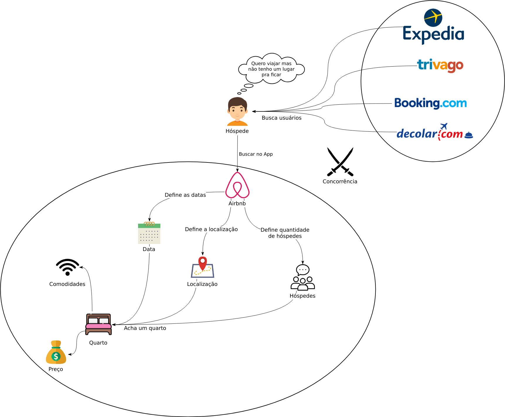
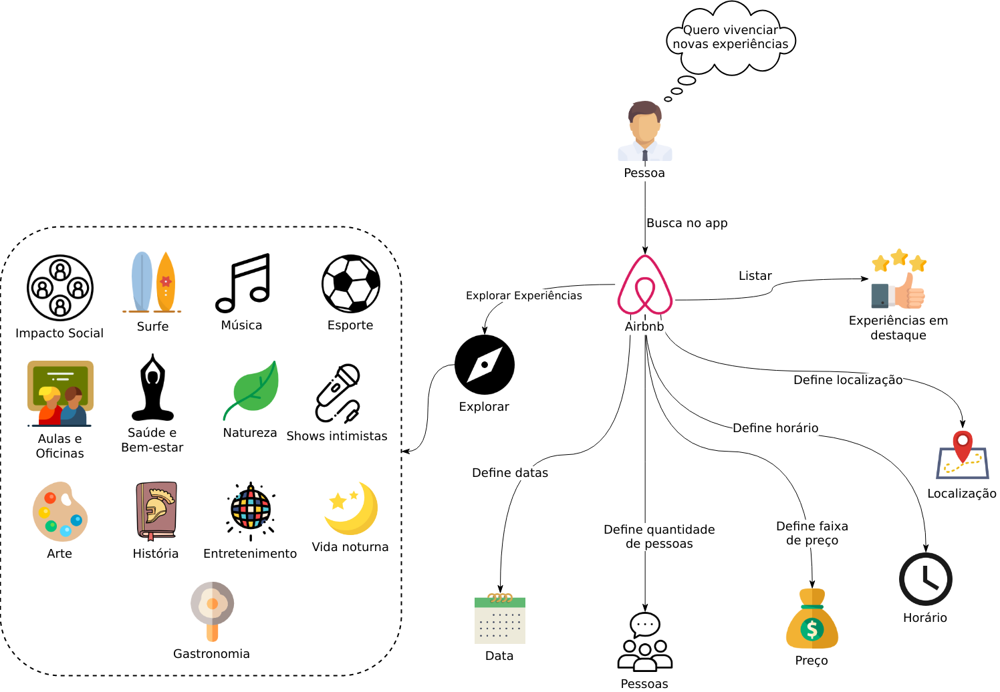
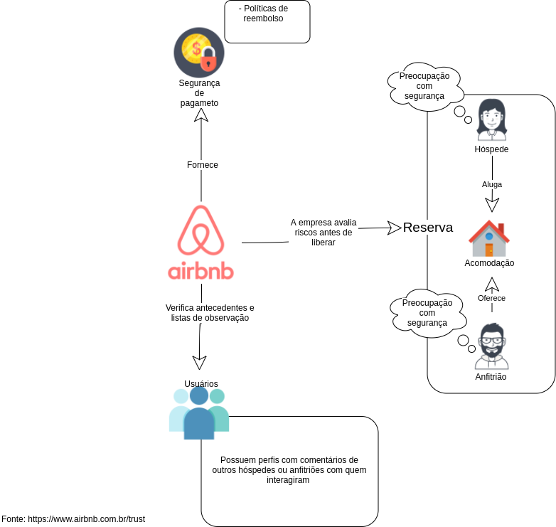

## Rich Picture

  Rich Picture é uma ferramenta para expressar ideias com o objetivo de resolver um problema, geralmente construídos durante uma entrevista com o cliente impactado pela solução. Ao desenvolver um Rich Picture o engenheiro de requisitos conhece melhor os problemas do cliente, e de forma iterativa refina o processo no qual sua aplicação trabalhará.

#### Visão Geral 1.0

  

<a name="rp1">

#### Hóspede 3.0

#### Anfitrião 3.0

#### Restaurante 1.0

#### Pesquisa de Experiência 1.0

#### Questões Regionais 1.0

#### Relações Entre Usuários 1.0

#### Monetário 2.0

#### Boas Experiências 1.0

#### Central de Resoluções 1.0

#### Segurança 1.0

