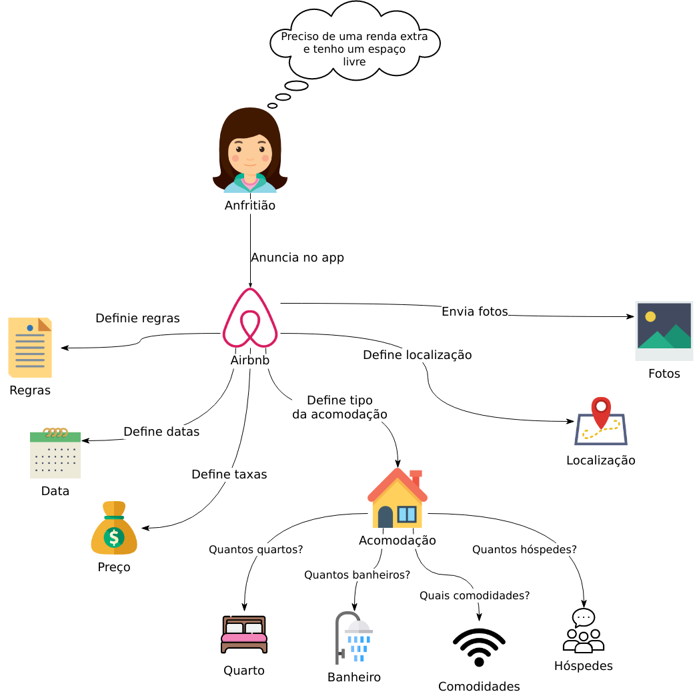
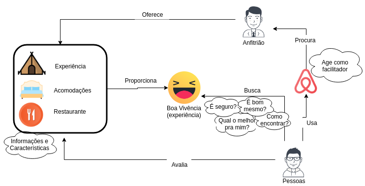
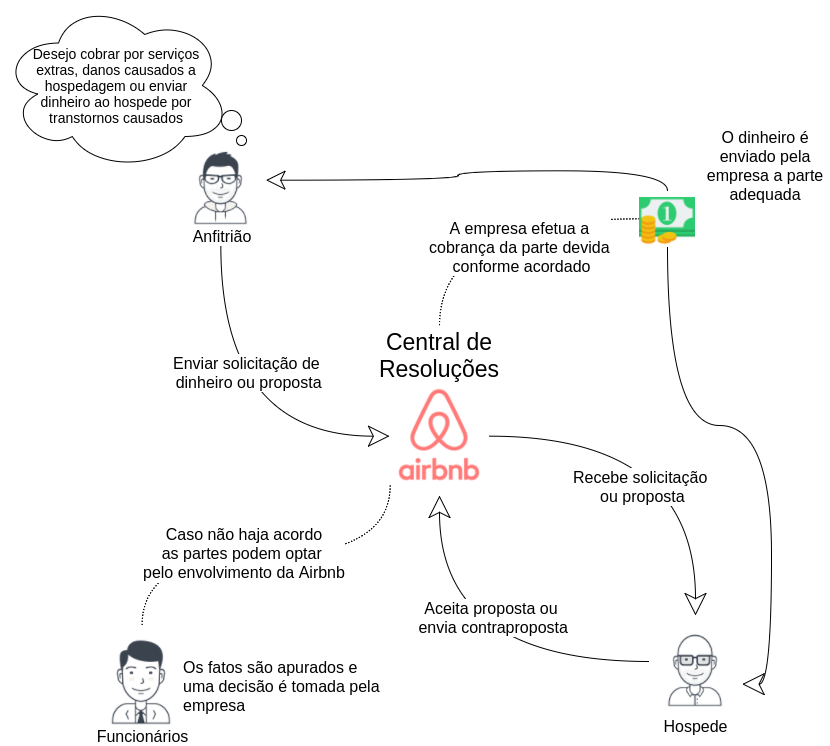

## Rich Picture

  Rich Picture é uma ferramenta para expressar ideias com o objetivo de resolver um problema, geralmente construídos durante uma entrevista com o cliente impactado pela solução. Ao desenvolver um Rich Picture o engenheiro de requisitos conhece melhor os problemas do cliente, e de forma iterativa refina o processo no qual sua aplicação trabalhará.

#### RP01 - Visão Geral 1.0

  

<a name="rp1">

#### RP02 - Hóspede 3.0

#### RP03 - Anfitrião 3.0

#### RP04 - Restaurante 1.0

#### RP05 - Pesquisa de Experiência 1.0

#### RP06 - Questões Regionais 1.0

#### RP07 - Relações Entre Usuários 1.0

#### RP08 - Monetário 2.0

#### RP09 - Boas Experiências 1.0

#### RP10 - Central de Resoluções 1.0

#### RP11 - Segurança 1.0

