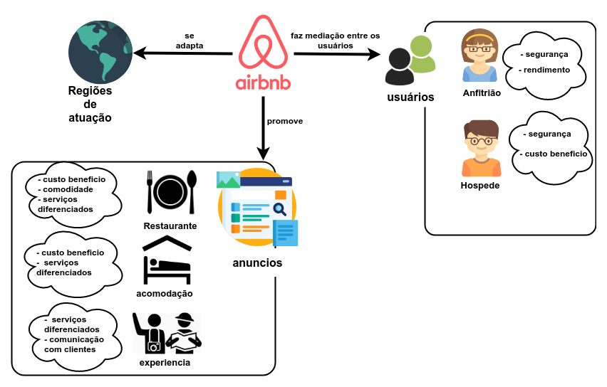
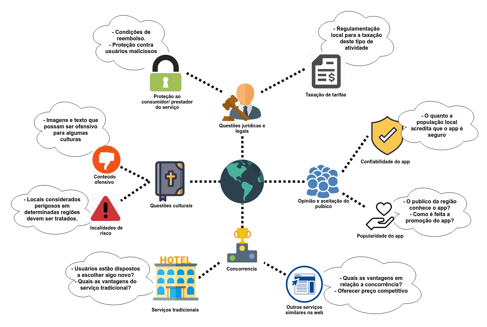
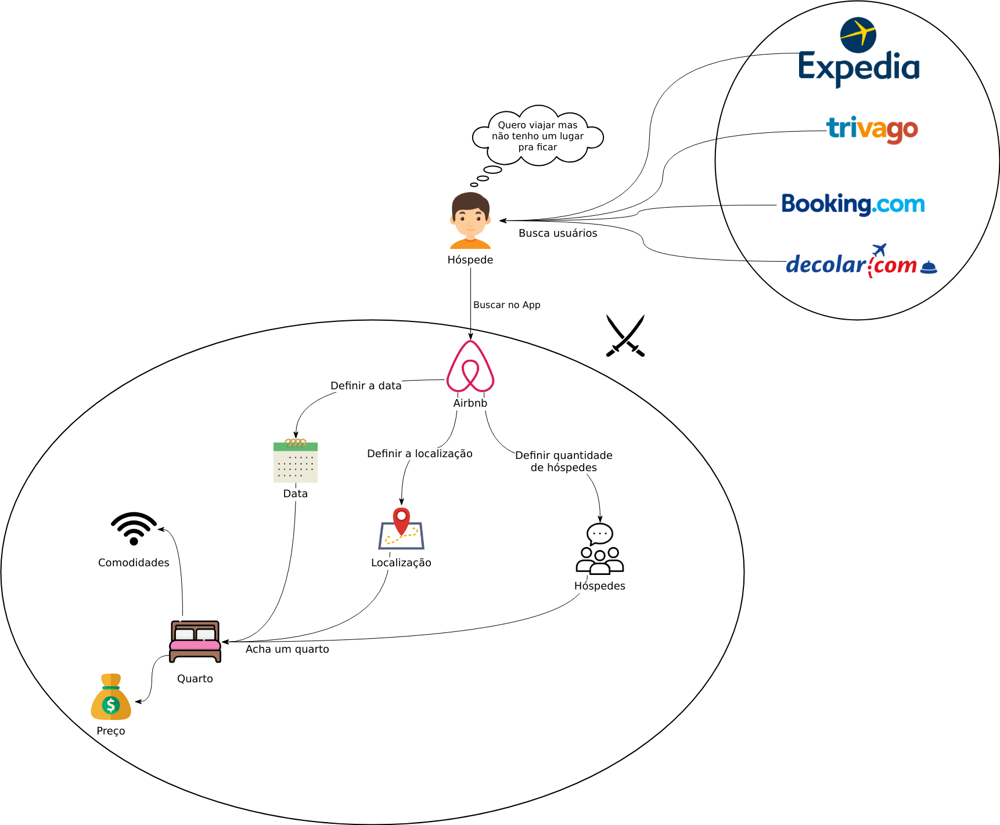
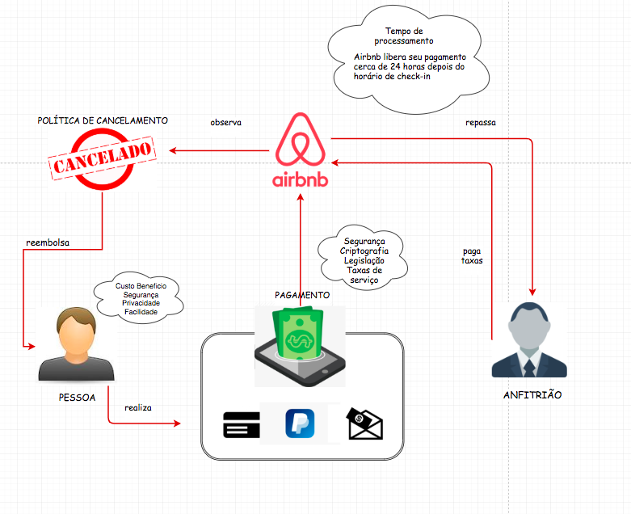
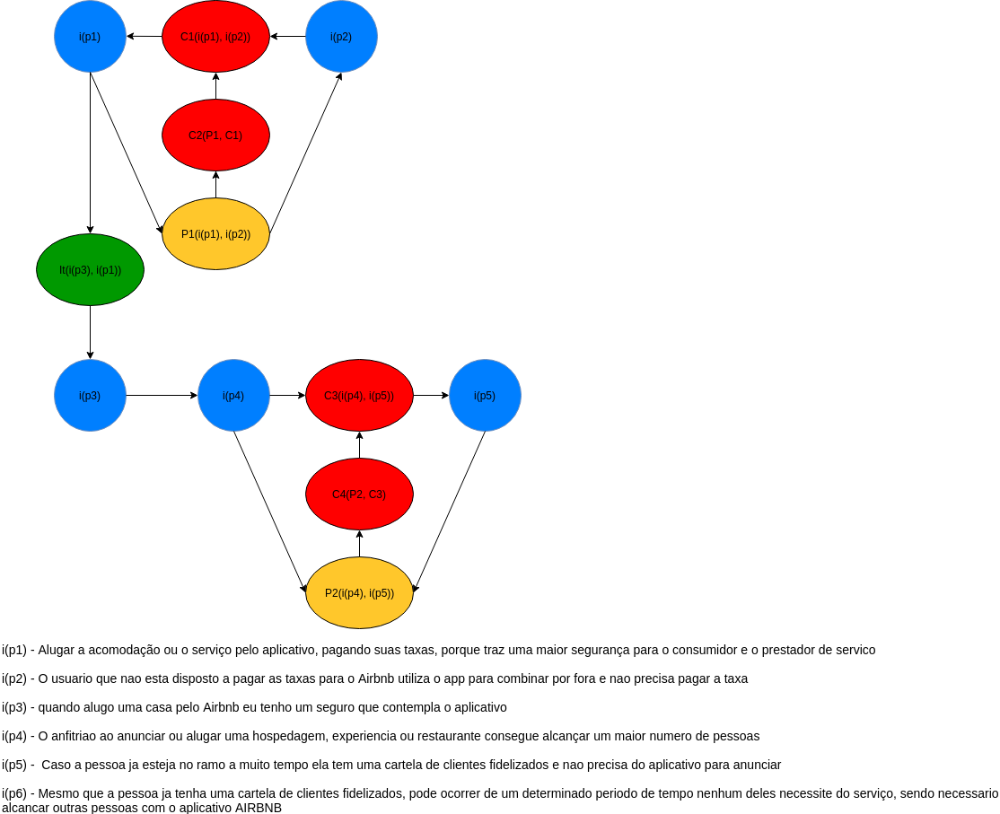
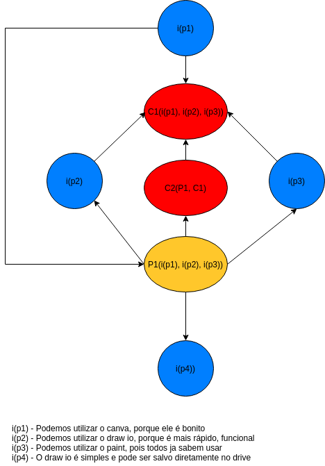

# Pré Rastreabilidade

***

## Rich Picture

  <h3>Visão Geral</h3>
  

  <h3>Questões Regionais</h3>
  

  <h3>Relações Entre Usuários</h3>
  

  <h3>Hospede</h3>
  

  <h3>Anfitrião</h3>
  

  <h4>Monetário</h4>
  

## Argumentação

  <h3>Vale a pena pagar os 3% para o anfitrião?</h3>
  

  <h3>Ferramenta para fazer o rich picture</h3>
  

