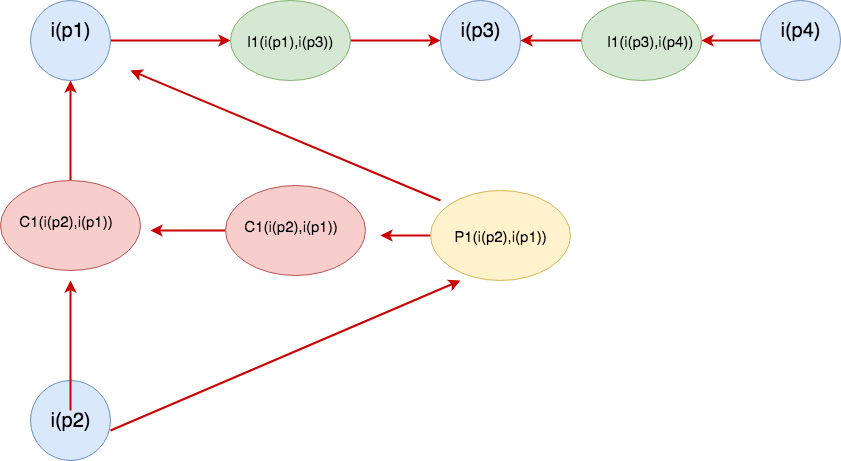
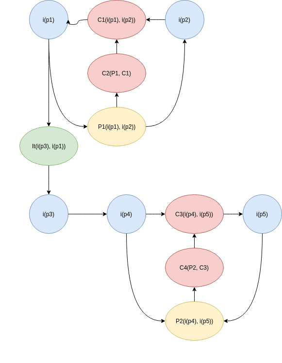

# Pré Rastreabilidade

***

## Rich Picture

<!-- image in 100% pls  -->
  <h3>Visão Geral</h3>
  

  <h3>Questões Regionais</h3>
  

  <h3>Relações Entre Usuários</h3>
  

  <h3>Hospede</h3>
  

  <h3>Anfitrião</h3>
  

  <h3>Monetário</h3>
  

  <h3>Boas Experiências</h3>
  

  

## Argumentação

  <h3>Escolha de ferramenta de desenho</h3>
  
  <ul>
    <li>
      <b>p0</b> - É necessário usar uma ferramenta de desenho unificada para haver padrão de linguagem nos diagramas de rich picture.
    </li>
    <li>
      <b>p1</b> -  Usar draw io para a execução do rich picture, devido as ferramentas de estilo.
    </li>
    <li>
      <b>p2</b> -  Usar canvas para a execução do rich picture, devido as ferramentas de estilo.
    </li>
    <li>
      <b>p3</b> - draw io pode ser usado apartir do browser e  tem compatibilidade com o google drive.
    </li>
  </ul>

  <h3>Hospedeiro que já trabalha na área</h3>
  
  <ul>
    <li>
      <b>p0</b> - Usuário possui bom fluxo de clientes e não busca por novos clientes
    </li>
    <li>
      <b>p1</b> - Usuário percebe que apesar de ter bom fluxo, poderia aumenta-lo ainda mais e/ou utilizar de estratégias para tempos de baixo fluxo.
    </li>
    <li>
      <b>p2</b> - Usuário não deseja ampliar o perfil de seus clientes, devido necessidade de de altos investimentos.
    </li>
    <li>
      <b>p3</b> - Através do Airbnb é possível buscar novos clientes a um investimento muito baixo.
    </li>
  </ul>

    <h3>Preocupação do anfitrião</h3>
  
  <ul>
    <li>
      <b>p0</b> - O anfitrião se preocupa apenas com o dinheiro que ele vai ganhar
    </li>
    <li>
      <b>p1</b> - A preocupação deve ser maior com a experiência pois existe o sistema de avaliação do airbnb.
    </li>
    <li>
      <b>p2</b> - Usuário não deseja ampliar o perfil de seus clientes, devido necessidade de de altos investimentos.
    </li>
    <li>
      <b>p3</b> - As duas são importantes porém se preocupando com a experiência consequentemente terá boas avaliações e muitos clientes.
    </li>
  </ul>

  <h3>Vale a pena pagar os 3% do anfitrião</h3>
  
  <ul>
    <li>
      <b>p0</b> - Alugar a acomodação ou o serviço pelo aplicativo, pagando suas taxas, porque traz uma maior segurança para o consumidor e o prestador de servico
    </li>
    <li>
      <b>p1</b> -  O usuario que nao esta disposto a pagar as taxas para o Airbnb utiliza o app para combinar por fora e nao precisa pagar a taxa
    </li>
    <li>
      <b>p2</b> -  Quando alugo uma casa pelo Airbnb eu tenho um seguro que contempla o aplicativo.
    </li>
    <li>
      <b>p3</b> - O anfitriao ao anunciar ou alugar uma hospedagem, experiencia ou restaurante consegue alcançar um maior numero de pessoas.
    </li>
    <li>
      <b>p4</b> - Caso a pessoa ja esteja no ramo a muito tempo ela tem uma cartela de clientes fidelizados e nao precisa do aplicativo para anunciar.
    </li>
    <li>
      <b>p5</b> - Mesmo que a pessoa ja tenha uma cartela de clientes fidelizados, pode ocorrer de um determinado periodo de tempo nenhum deles necessite do serviço, sendo necessario
      alcancar outras pessoas com o aplicativo AIRBNB
    </li>
  </ul>

