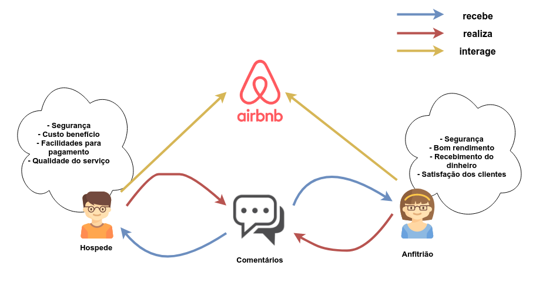

# Pré Rastreabilidade

***

## Rich Picture

<!-- image in 100% pls  -->
  <h3>Visão Geral</h3>
  

  <h3>Questões Regionais</h3>
  

  <h3>Relações Entre Usuários</h3>
  

  <h3>Hospede</h3>
  

  <h3>Anfitrião</h3>
  

  <h3>Monetário</h3>
  

  <h3>Boa Experiência</h3>
  

  <h3>Central de Resoluções</h3>
  

## Argumentação

  <h3>Escolha de ferramenta de desenho</h3>
  
  <ul>
    <li>
      <b>p0</b> - É necessário usar uma ferramenta de desenho unificada para haver padrão de linguagem nos diagramas de rich picture.
    </li>
    <li>
      <b>p1</b> -  Usar draw io para a execução do rich picture, devido as ferramentas de estilo.
    </li>
    <li>
      <b>p2</b> -  Usar canvas para a execução do rich picture, devido as ferramentas de estilo.
    </li>
    <li>
      <b>p3</b> - draw io pode ser usado apartir do browser e  tem compatibilidade com o google drive.
    </li>
  </ul>
  <h3>Hospedeiro que já trabalha na área</h3>
  
  <ul>
    <li>
      <b>p0</b> - Usuário possui bom fluxo de clientes e não busca por novos clientes
    </li>
    <li>
      <b>p1</b> - Usuário percebe que apesar de ter bom fluxo, poderia aumenta-lo ainda mais e/ou utilizar de estratégias para tempos de baixo fluxo.
    </li>
    <li>
      <b>p2</b> - Usuário não deseja ampliar o perfil de seus clientes, devido necessidade de de altos investimentos.
    </li>
    <li>
      <b>p3</b> - Através do Airbnb é possível buscar novos clientes a um investimento muito baixo.
    </li>
  </ul>

